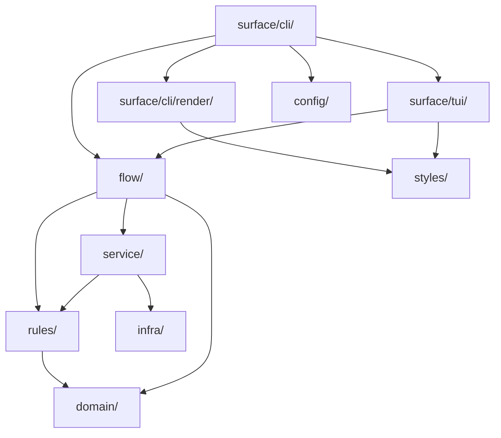

# Architecture — the layers and what they buy

wtm is a Cobra CLI with two interactive surfaces (an inline wizard and the `wtm ui` dashboard) over one set of git operations. The layering exists so that a command's *flow* — the order of its questions, its safety checks, its service calls — is written once and can be replayed by either surface.

## The map

One line per package: what it owns. The import rules between them are the next section.

```
cmd/                          ← entry points, cobra setup only
internal/
  domain/                     ← types, errors, constants only (no methods, no functions)
  rules/                      ← pure functions (stdlib + domain only, no I/O)
  kernel/                     ← the skeleton of the command engine (stdlib only, no business vocabulary): Command,
                                fields, rules, errors, results, Each / Saga (commands.md)
    text/                     ←   the one catalogue turning a kernel.Code and its params into English
    kerneltest/               ←   the checks every command runs on itself (DependsOn, sagas)
  config/                     ← load & validate config.toml + run.toml from <git-common-dir>/wtm/, plus the global config (config.GlobalPath);
                                every write puts the file's JSON schema (schemas/) beside it
  flow/                       ← the flow of each command, surface-independent (see below):
                                the vocabulary (Step, Session, Prompter, Presenter, Publisher)
    publish/                  ←   the event a flow publishes after a change to a worktree's
                                  identity, read back from git and meta.json (`wtm events`)
    ordinal/                  ←   allocating a worktree's ordinal from the flow that needs it,
                                  published as `worktree.updated`; the service only reads it
    decide/                   ←   branch/env decisions shared by the create-like flows
    envports/                 ←   settling a fresh .env's host ports onto the ones the
                                  worktree binds, per its isolation (isolated / verbatim,
                                  recorded in meta.json and read by the daemon too) —
                                  shared by `create`, `extract` and `checkout`, which it
                                  never fails: a refused run.toml or an unreadable ordinal
                                  is a warning (`SettleFresh`), the run part left undone
    create/                   ←   `wtm create`: the run (create.go) + its questions (steps.go)
    checkout/                 ←   `wtm checkout`: the run (checkout.go) + its questions (steps.go)
    clean/                    ←   `wtm clean`: the run (clean.go) + its questions (steps.go)
    reparent/                 ←   `wtm reparent`: the run (reparent.go) + its questions (steps.go)
    prune/                    ←   `wtm prune`: the run (prune.go) + its questions (steps.go)
    extract/                  ←   `wtm extract`: the run (extract.go) + its questions (steps.go),
                                  create's own embedded through `create.Embed`
    env/                      ←   `wtm env`: the run (env.go) + its questions (steps.go), the
                                  pre-scan the wizard reads (scan.go), how the worktree runs
                                  today that its isolation and addressing steps keep or switch
                                  (mode.go), and the port pass and isolation switch (pass.go);
                                  its per-key resolver is its own kind, `flow.StepEnvResolve`
    relocate/                 ←   `wtm relocate`: the run (relocate.go) + its questions (steps.go);
                                  the move, the adoption and the base_path rewrite are three
                                  separate service calls (`worktree.Move`/`Adopt`/`SetBasePath`)
    teardown/                 ←   the removal clean and prune share, one worktree or a
                                  batch (`Batch`): stop, hooks, remove, drop — then
                                  release every claim, all together
    orphans/                  ←   the question clean and prune ask about the children a
                                  removal orphans: the step, its preset, its recap line
    sync/                     ←   `wtm sync`: the run (sync.go) + its questions (steps.go)
    fastforward/              ←   `wtm fast-forward`: the run + its questions
    exec/                     ←   `wtm exec`: the run + its questions
    status/                   ←   `wtm status`: a worktree's state read without asking,
                                  numbering or waking anything (no Prompter, no Presenter)
    runlogs/                  ←   the jobs a surface shows (`Board`), their live streams,
                                  and the profile start sequence (reports events, not steps)
    run/                      ←   the `run` module's flows, mirroring its command tree:
      target/                 ←     the questions they share (worktree, job, profile,
                                    and the published-url step `run open` asks)
      urls/                   ←     where every address the module hands out is computed
      seam/                   ←     the daemon as a flow uses it: board, env, log dir,
                                    port prober, and the start sequence a surface drives
      foreigndata/            ←     the stop before a job whose `touches` reach data the
                                    worktree does not own, shared by `up` and `start`
      probes/                 ←     the offer to write `probe = false` for a job bound to its
                                    base port, made after `up` and `start` alike
      owed/                   ←     paying the namespace drops a clean deferred, whenever a run
                                    finds their shared service up
      addressing/             ←     `run addressing`: switch the mode, settle the worktrees' .env
      concurrency/            ←     the question about the other worktrees' jobs (load or
                                    port clash, `--exclusive`/`--parallel`), shared by `up` and `start`
      up/ down/ start/        ←     one package per command, as everywhere else
      stop/ logs/ open/ url/
      list/                   ←     `run list`: which entry was picked and what to do to it
      job/ profile/           ←     CRUD on run.toml's declarations, one package per group
      initrun/                ←     `run init`: detect, ask (the services wizard is its own
                                    `Wizard` seam, not a flow.Session), write run.toml,
                                    compose and .env files
  service/                    ← impure orchestration only (git exec, I/O, hooks):
    worktree/                 ←   git worktree operations (create, list, remove)
    env/                      ←   .env provisioning (create) + drift reconciliation (`wtm env`, sync.go)
    hooks/                    ←   on_create / on_clean hook execution (a /bin/sh line each)
    shell/                    ←   shell integration generation (zsh, bash, fish)
    integration/              ←   third-party adapters: handing a URL to the desktop's
                                  own opener (editor/agent detection lives in detect/)
    proxy/                    ←   the run proxy: the host→job routing table and the
                                  loopback server the daemon owns (`[proxy]`)
    detect/                   ←   auto-detection (base branch, env files, package manager)
    branch/                   ←   branch candidates for the pickers (local + origin, divergence)
    github/                   ←   pull requests through the `gh` CLI
    selfupdate/               ←   how wtm was installed, and `wtm upgrade`
    process/                  ←   the run daemon: jobs on PTYs, the durable index (jobs.json),
                                  reaping orphans, the client the commands talk through, and
                                  the schema-blind event broker (`publish` / `subscribe`)
    events/                   ←   the `wtm events` bus as wtm uses it: the Publisher every flow
                                  reports through, Watch (subscribe → snapshot → ready), the
                                  registry of repositories wtm was used in (`repos.json`, through
                                  `infra/registry.go`) and WatchAll, which follows all of them
    runconfig/                ←   load + validate + write run.toml (and its schema)
    runjobs/                  ←   the daemon's jobs as a surface reads them (the dashboard too);
                                  `Current` reads the index itself when no daemon listens
    compose/                  ←   a compose file's `ports:` and absolute names, read and rewritten
    portprobe/                ←   is anything listening on a port
    shellcmd/                 ←   checks that a config command is a valid /bin/sh line
    execsvc/                  ←   runs one shell line in several worktrees at once
    memory/                   ←   writes the answers the wizard remembers ([wizard.remembered] in config.toml)
  styles/                     ← all Lipgloss styles (only package allowed to instantiate lipgloss.Style)
  infra/                      ← I/O, git exec, filesystem wrappers
  surface/                    ← the interfaces
    cli/                      ←   flag wiring, delegates to flow/service (zero business logic)
      run/runctx/             ←     what every `run` command opens on: its directory, the config,
                                    run.toml, the opt-in guard and the prompt gate
      daemon/                 ←     the hidden `daemon` command and the macOS port-80 relay launchd runs
      ui/                     ←     `wtm ui`: refuses JSON and a missing TTY, then hands off to tui/dashboard
      events/                 ←     `wtm events`: the stream (text or JSON Lines) over service/events.Watch,
                                    or WatchAll outside any repository
      versioncmd/             ←     `wtm version`: the binary's version and each machine contract's (`events`)
      render/                 ←     format and print results (zero decision logic)
    tui/                      ←   Bubbletea models (zero business logic, rendering only)
      flowui/                 ←     runs a flow.Session as a wizard (the only translator
                                    between flow.Step and components.Step)
      dashboard/              ←     `wtm ui`: the full-screen worktree dashboard, the second
                                    surface over flow/ (its own Prompter/Presenter, mouse
                                    zones via bubblezone). It also hands the terminal to
                                    runview (`handoff.go`) for the run flows that draw
      runview/                ←     a job's raw PTY output replayed through a terminal
                                    emulator (`github.com/charmbracelet/x/vt`)
```

## Who may call whom



Every arrow that is *missing* is the point:

| Interdiction | What it buys |
| -- | -- |
| `surface/cli/` has no business logic | A command is readable as flags in, one call out. Changing the flow never means editing flag parsing. |
| `domain/` holds types, errors and constants only | Nothing can acquire a dependency by hiding behind a method on a shared type. |
| `rules/` imports only stdlib + `domain/` | Decisions stay testable with no repo, no network, no temp dir. `rules.DecidePush` is a table test, not an integration test. |
| `kernel/` imports only the stdlib | The skeleton carries no business vocabulary: a command composes `kernel` with `domain/`, never the reverse, so a change to the domain never reaches the contract every command, `dispatch` and surface share. I/O reaches it only as functions it is handed (`Observe`, `Apply`, the `Shield`). |
| `service/` never imports cobra, bubbletea or lipgloss | The git operations are callable from a test, a flow, a daemon — anything that is not a terminal. |
| `surface/cli/render/` and `surface/tui/` hold no decision logic | Two surfaces can render the same run without disagreeing about what it means. |
| `styles/` is the only package instantiating `lipgloss.Style` | A theme change is one file. |
| `flow/` imports only `service/`, `rules/`, `domain/` and the stdlib | The flow cannot grow a dependency on the surface that runs it. This is what makes a second surface possible at all — see below. |

`flow/` cannot reach `infra/` either. When a flow needs something only `infra/` has, the fix is a thin `service/` wrapper, not an exception: `worktree.FindByBranch` and `worktree.ListAll` exist for exactly that reason.

Two more edges are constrained beyond the diagram:

- `service/x` imports `service/y` only along an edge declared in `tools/archlint` (`serviceEdges`): today `detect→branch`, `events→{process,worktree}`, `process→proxy`, `runconfig→shellcmd`, `runjobs→{process,runconfig,worktree}`, `worktree→{branch,env,github,hooks,process}`.
- The daemon — `service/process` and `service/proxy`, which it serves — is blind to git: neither imports `service/worktree`, `service/branch`, `service/github`, `service/events` or `config`, and both call only allow-listed `infra/` functions (`GlobalDir`).
- A service **mutator** (`worktree.Create`, `envsvc.ApplyEnvSync`, `runconfig.Save`, … — the table in `tools/archlint/chokepoint.go`) is called only from `internal/flow/`, whatever the calling layer; a call inside the mutator's own package is its implementation.

None of this is left to review: `make lint` runs `tools/archlint`, and each rule above is one of its analyzers. The full list, and how to add one, is in [lint.md](lint.md).

## How a command designates a worktree

One rule, no exception: **the subject is positional, and a worktree that is not the subject is a flag named after its role.** `clean [branch]`, `env [worktree]`, `extract [source]`, `sync [branch...]` take their subject positionally; `extract --to`, `create --from`, `sync --base` name a second worktree. The `run` module follows the same rule with the worktree as its subject — `run up [worktree] --profile`, `run start [worktree] --job` — so the job and the profile are flags. A new command adds no third form.

Omitting the positional resolves in one of two ways, and which one is not a matter of taste: **the current directory when it is a safe default for that command, a picker otherwise.** `run` has one (you are standing in the worktree whose services you want), so a non-interactive run silently takes it — category 1 of the bypass model, no exception to write. `clean` has none (which worktree would it destroy?), so it errors or opens a picker — category 2.

Whatever answers, a resolved worktree is always **the worktree root as git spells it** (`infra.Toplevel`), never a raw `os.Getwd()`. The daemon keys a job on `name + WorkDir` by string equality *and* runs it there, resolving `run.toml`'s `cwd` against it: a subdirectory, or macOS's `/var` where git says `/private/var`, splits one worktree into two keys and mis-resolves every relative `cwd`.

## The founding observation: seven closures

Before this layering existed, `internal/surface/cli/wt/*.go` did three things at once: read the flags, run the flow itself, **and** hand the TUI closures that called back into the service. The TUI is forbidden from importing `service/`, so the command passed it functions instead:

| Closure injected into the TUI | Command | What it called back into |
| -- | -- | -- |
| `SourceUpdate` | `create`, `extract` | `branch.Divergence` |
| `Target` | `create`, `extract` | `branch.Target` |
| `EnvFallback` | `create`, `extract` | `shared.EnvParentFallbackApplies` |
| `Check` | `clean` | `worktree.Check` |
| `ReparentPreview` | `clean` | `worktree.PlanCleanReparent` |
| `PlanPreview` | `sync` | `worktree.PlanSync` + `render.SprintSyncPlan` |
| `LoadFiles` | `extract` | `infra.ListModifiedFiles` |

The rule was respected and the architecture was still defeated: the service call happened on the TUI's goroutine, at the TUI's whim, with the command as a courier. Worse, the flow lived on both sides of that boundary — the dashboard could not replay it without duplicating it.

`flow/` **is allowed** to call the service. Those closures become hooks carried by the step declaration itself (`Skip`, `Build`, `Load`) and the courier disappears. That is the gain that justifies the refactor independently of the dashboard: `create` and `clean` inject nothing today.

The closures went with their command's migration: `checkout`'s `EnvFallback` and `Target` are now read by its recap step directly. `prune`'s `ReparentPreview` and `sync`'s `PlanPreview` both went with their migration — a flow calls `rules.FinalizePrunePlan` and `rules.SprintSyncPlan` directly, and `internal/surface/tui/syncpicker` (the package `PlanPreview` was injected into) no longer exists. `extract`'s three went with its migration, along with `LoadFiles`: its files step loads them itself, and the create sub-flow it embedded in Bubbletea terms is now create's own steps, through `create.Embed`.

## The run module — a flow that asks nothing

`internal/flow/runlogs` is the second shape a flow takes. `create` and `clean` ask questions and need a `Prompter`; a run has none to ask — it *reports*. So the seam is made of three types instead:

- **`runlogs.Board`** — the worktree's jobs as a surface reads them: `Jobs()` (a `JobView` per declared or running job), `Refresh()`, `Attach()` for a live `Stream`, and `History()` for what a job left in its log file. A surface never speaks to `service/process`.
- **`runlogs.Stream`** — one attached job: raw chunks in (escape sequences included, an emulator needs them untouched), keystrokes and a PTY resize out.
- **`runlogs.Run(ctx, RunParams)`** — a profile's start sequence, reporting each step to a `Sink` as an `Event`/`Phase`. It returns an `Outcome`, never an error: what a partial state is worth — an exit code, a report, a JSON entry — belongs to the surface. Cancelling `ctx` ends the *reporting*, not the jobs: that is what a detach is.

Three surfaces consume it, chosen by one pure rule (`rules.DecideRunSurface`, which needs a terminal, a human format and no `-d` before it picks the view):

| Surface | Who | What it does with the seam |
| -- | -- | -- |
| `internal/surface/tui/runview` | a terminal | full screen, one VT-emulated pane per job, tmux-style focus; returns its recap for the command to frame |
| `render.RunPrinter` | `-d`, a pipe, CI | renders each `Event` as a line on stdout/stderr |
| `render.WriteRunOutcomeJSON` | `--output json` | the array of job results, with the failing job's `output` and `exit_code` |

Everything a job needs to know about *which* worktree it belongs to is resolved by the client and travels down the seam beside `WorkDir` and `LogDir`: `RunParams.Env` → `StartRequest.Env` → `process.Request.Env` → `cmd.Env`. It cannot be inherited — the daemon is global, outlives the command that forked it, and its own environment belongs to whichever worktree happened to start it. `service/worktree.EnsureOrdinal` is what gives the worktree the stable number those variables derive from, and `service/worktree.JobEnv`/`BranchEnv` assemble them; the daemon keeps the resolved map on the `ManagedJob` so the job's stop command runs in the same environment its start did.

`internal/surface/cli/run/surface.go` is the whole wiring: open the seam, build the starter, switch on the rule. The one thing left in the command is `handleConcurrentJobs` — the question `run up` asks about another worktree's jobs. It is a `flow.Prompter` question in everything but name, and `runlogs` has no Prompter; it stays put until the `--exclusive`/`--parallel` axis is reopened, which worktree isolation may remove entirely.

## Worktree ports and the `.env` — a terminal transformation, not a source

Two modules meet on the `.env` files, and the order they meet in is the whole design.

`internal/service/env` reconciles a worktree's `.env` against a **cascade of value sources** — the parent worktree, then main, then the committed template. `internal/rules/jobports.go` resolves the **host ports** a worktree binds: the base declared in `run.toml` plus that worktree's offset. A `[[env_port]]` link says a `.env` key carries one of those ports, whether alone (`DB_PORT=5432`) or buried in a URL (`DATABASE_URL=postgres://…@localhost:5432/app`).

The tempting move is to make the resolved port a fourth value source. It is wrong, and expensively so. The sources all hold *another* worktree's port — main's, or the parent's — so in `EnvModeRefresh` the key lands in `EnvKeyConflict` between two spellings of the same setting, and `--on-conflict overwrite` dutifully restores main's port, undoing the isolation on every run.

So the port is applied **after** the merge, once, in `settleEnvPorts`, and the diff is taught to compare *modulo the offset*:

| Piece | Where | What it does |
| -- | -- | -- |
| `rules.PlanEnvPorts` | pure | resolves every link against the value on disk; only a base found **exactly once** is rewritten |
| `rules.ReduceEnvPortValue` | pure | rewinds any worktree's port to the base, so `5442` and `5432` compare equal |
| `rules.DiffEnv` (`PortBases`, `PortBlock`) | pure | the single comparison site, in `classifyKey.differ` |
| `env.ApplyEnvPorts` | service | the write, after every file is reconciled |

Two consequences worth keeping:

- **The reduction is modular, not subtractive.** Under the `parent` strategy the source value comes from another worktree whose offset the reader never learns, so `ReduceEnvPortValue` looks for *a number of the shape `base + k×block`* rather than for one known value. A value with no such number, or with two, is left alone — reducing on a guess would hide a real conflict.
- **Every match is bounded by digit boundaries.** Without them base `5432` matches inside `54321` and the substitution silently corrupts the value, which is the exact failure the feature exists to prevent.

The cross-file check has to live outside `config.LoadRun`: that loader only ever sees `run.toml` and validates what `run.toml` can answer for alone. Whether a link names a configured env target needs `config.toml` too, so `rules.ValidateEnvPortTargets` is called where both are in hand — `service/worktree.ResolveEnvPorts`.

**Where the question is put, on a worktree being created.** `internal/flow/envports.Settle` runs after `worktree.Create` — it needs the files to exist — but it does not *decide* there. The decision is the worktree's **isolation**, a step of the run that provisions those files (`create.KeyIsolation`, `checkout.KeyIsolation`, `components.IsolationStep` for the wizard of `extract`), skipped whole when `rules.IsolationApplies` finds nothing in `run.toml` to isolate. `worktree.Create` records the answer in `meta.json` before any hook runs, since a hook reads the ports it decides.

**One choice, read by both halves.** Isolation is not a port-pass option; it is what the worktree *is*, and two readers act on it:

| Reader | Isolated | Verbatim |
| -- | -- | -- |
| `service/worktree.ResolveEnvPorts` — every `.env` writer (create, extract, checkout, `wtm env`, the addressing switch) | links, identity and `[[env]]` values resolved and written | resolves to nothing: the file stays as copied |
| `service/worktree.BranchEnv` — every job and hook | `WTM_PORT_OFFSET = ordinal × block`, `COMPOSE_PROJECT_NAME` derived (the main's without its branch) | offset 0, `COMPOSE_PROJECT_NAME` left to the `.env`, `WTM_ISOLATION=verbatim` |
| `service/process.runNamespace` — the daemon | carves the worktree's namespace | carves nothing (read from `WTM_ISOLATION`: the daemon never reads metadata) |

They used to be separate: a "keep the ports" answer left the `.env` on its source's ports while the daemon still shifted the jobs, so a front read one port and its back bound another, and the worktree quietly talked to its source. Anything in between the two columns is incoherent by construction, which is why there is no third answer and no `Rewrite` flag any more. The cost of verbatim is that it shares its source's ports; `flow/run/up` measures that (`rules.PortClashes`) and turns the concurrency question into stop-the-other-or-don't-start rather than letting a bind fail. `wtm env --isolation` switches an existing worktree, and the interactive run asks the same question as a step that keeps the current isolation first, rather than skipping the port pass once.

## The event bus — the daemon relays, the flows speak, the jobs report

`wtm events` and `wtm ui` hear every change to a worktree's identity, whoever made it. The pieces, from producer to consumer:

- **`flow.Publisher`**, a seam on `flow.Context`. A flow publishes right after the mutator succeeds, through `internal/flow/publish` (`Created`, `Updated`, `Relocated`, `Reparented`, `Removed`), which reads the worktree's identity (`worktree.Identity`) after the change. A removal captures the identity *before* (`publish.Capture`), since git has forgotten the worktree once it is gone. A nil publisher publishes nothing, and neither does one that is not `Listening()`: the identity is never read for a run no daemon would relay.
- **`service/events.Publisher`** implements the seam. It stamps the envelope (`v`, `ts`, `repo`) and hands the payload to `process.Publish`, which dials the daemon with a 250 ms budget, never starts it, and reports an error its caller drops: no daemon means no subscriber, and the next subscriber gets the state from its snapshot. Its `Listening()` is a plain dial, asked before every event and never cached, since a run may start the daemon halfway through.
- **The daemon** (`service/process`, `eventhub.go`) is a broker that never decodes the payload: an envelope `{repo, payload}` in, the same out to every subscriber whose filter holds `repo`. A subscriber that falls 256 events behind is disconnected, never waited for; a subscription keeps the daemon alive; `stop()` closes every subscription. `daemonblind` forbids `service/process` to import `service/events`, so the broker cannot become schema-aware by accident.
- **Job events are the one kind the daemon writes**, since only it sees a job end. `Manager` reports each transition (`JobTransition`: started, crashed, exited, stopped) to `ManagerParams.OnTransition`, and `daemonServer.publishJob` marshals a `domain.JobEvent` into the hub. It stays blind to git: the repository and correlation id come from the client in `Request.Origin` (built by `flow.Context.Origin()` from the publisher), the branch from the job's `WTM_BRANCH`, and the origin is persisted in `jobs.json` so an adopted job can still publish its stop. A job started without an origin publishes nothing. A stop sets `ManagedJob.stopping` before it signals, so the reaper does not read the exit as a crash.
- **`service/events.Watch`** subscribes **before** it reads the snapshot (`worktree.Identities`, plus the daemon's job list mapped by `rules.WorktreeJobs`), so a change made meanwhile waits in the subscription and arrives after `ready`. On EOF it backs off and starts over with a fresh snapshot.

The ordinal is part of the identity, which is why `worktree.EnsureOrdinal` left the env readers: `JobEnv`, `BranchEnv`, `ResolveEnvPorts` and the hook environment now read the ordinal and answer `ErrOrdinalUnallocated` when there is none, and `internal/flow/ordinal` allocates — `Retry` around a read that asked for it, `BeforeHooks` before a hook phase that would read it — and publishes `worktree.updated`. A reader outside any flow (the dashboard's addresses) simply shows nothing for a worktree no run has numbered yet.

## Where each flow runs

Every worktree-mutating command goes through `flow/`; a new one does too — see [adding-a-mutation-command.md](adding-a-mutation-command.md). The surfaces each one is wired into:

| Command | Flow lives in | Surfaces |
| -- | -- | -- |
| `create` | `internal/flow/create` | CLI wizard, unattended, dashboard |
| `clean` | `internal/flow/clean` | CLI wizard, unattended, dashboard |
| `reparent` | `internal/flow/reparent` | CLI wizard, unattended, dashboard |
| `prune` | `internal/flow/prune` | CLI wizard, unattended, dashboard |
| `sync` | `internal/flow/sync` | CLI wizard, unattended, dashboard |
| `relocate` | `internal/flow/relocate` | CLI wizard, unattended |
| `checkout` | `internal/flow/checkout` | CLI wizard, unattended |
| `env` | `internal/flow/env` | CLI wizard, unattended |
| `extract` | `internal/flow/extract`, create's steps embedded | CLI wizard, unattended |
| `fast-forward` | `internal/flow/fastforward` | CLI wizard, unattended, dashboard |
| the `run` module | `internal/flow/run/<cmd>` | CLI, run view, dashboard |
