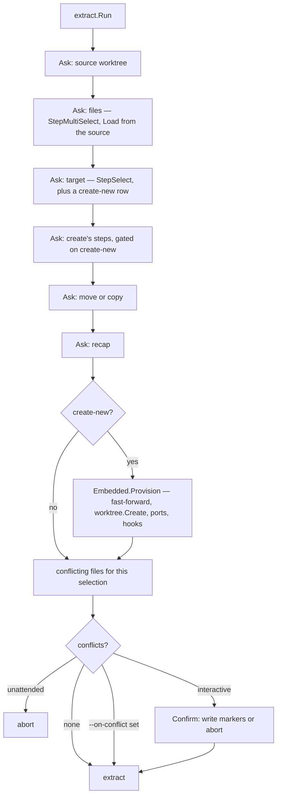

# `internal/flow/` — how a command runs

A *flow* is everything a command does between "the flags are parsed" and "the result is printed": the questions it asks and in what order, which ones it may skip, the safety checks, the service calls, the phases it reports, the events it publishes. It is written once, in `internal/flow/<command>/`, and three surfaces run it: the CLI wizard, the unattended CLI, and the dashboard. Which command runs on which surface is the table in [architecture.md](architecture.md#where-each-flow-runs); the recipe for a new one is [adding-a-mutation-command.md](adding-a-mutation-command.md).

- [The shape of a flow](#the-shape-of-a-flow)
- [The three seams](#the-three-seams)
- [The step model](#the-step-model)
- [Unattended resolution and the two axes](#unattended-resolution-and-the-two-axes)
- [A flow that embeds another](#a-flow-that-embeds-another)
- [Surfaces and scheduling](#surfaces-and-scheduling)
- [Hook output](#hook-output)
- [Publishing what a flow changed](#publishing-what-a-flow-changed)
- [Testing a flow](#testing-a-flow)
- [Settled decisions](#settled-decisions)
- [Known gaps](#known-gaps)

## The shape of a flow

One package per command, splitting the run from the questions it asks:

```
internal/flow/create/
  create.go   the run: Request, Outcome, Presenter, Params, Run, Operation
  steps.go    the session: the flow.Step declarations and the recap
```

The entry point is always the same shape — one struct parameter, one outcome, one error:

```go
type Params struct {
	Context   flow.Context  // ProjectDir, StateDir, Config, Publisher
	Request   Request       // what the surface already knows
	Prompter  flow.Prompter // who answers the questions
	Presenter Presenter     // where the phases go
}

func Run(params Params) (Outcome, error)
```

`Run` is a package-level function; behind it an unexported `createFlow` / `cleanFlow` struct holds the params so the step declarations can close over them.

**Errors are returned, never presented.** There is no `Presenter.Error`: on the CLI Cobra prints the error and `rules.ExitCode` sets the status; on the dashboard the caller puts it in the output panel. A user abort is not an error: the flow emits `flow.AbortedNotice` and returns `Outcome{Aborted: true}` with a `nil` error.

## The three seams

### `flow.Prompter` — who answers

```go
type Prompter interface {
	Ask(Session) (Answers, error)
	Confirm(ConfirmParams) (bool, error)
	Interactive() bool
}

type Session struct {
	ErrLabel string  // what the host calls the command if a step errors
	Steps    []Step
	Presets  Answers // values the request already carries
}
```

- **`Ask`** runs a whole question-and-recap sequence and returns every answer keyed by `Step.Key`, or `domain.ErrUserAborted`.
- **`Confirm`** is a standalone decision that only exists *after* an execution — a fast-forward that failed, a removal that needs `sudo`, extract's conflicts.
- **`Interactive`** is read for exactly two purposes: not offering a decision nobody can answer, and feeding a pure rule that takes it as input (`rules.DecidePush`). Any other use puts the bypass taxonomy back into the commands.

| Implementation | Where | `Ask` | `Confirm` | `Interactive()` |
| -- | -- | -- | -- | -- |
| `flowui.Prompter` | `internal/tui/flowui` | `components.RunWizard` | `components.RunStandaloneConfirm` | `true` |
| `flow.Unattended` | `internal/flow/unattended.go` | resolves with no interaction | `false, nil` | `false` |
| `dashboard.prompter` | `internal/tui/dashboard/prompter.go` | a modal, over a reply channel | a one-question modal | `true` |

`Unattended` lives in `flow/` because it is the only implementation with no surface dependency, and it carries the bypass taxonomy, which must exist once.

### `flow.Presenter` — where the phases go

```go
type Presenter interface {
	Stage(StageParams) error         // one unit of work under a progress indicator
	HookPhase(HookPhaseParams) error // a titled hook phase and the sink it streams into
	Notice(Notice)                   // concludes the run
	Status(Notice)                   // one line inside an ongoing phase
}
```

A flow never frames, never animates and never picks a stream: it says *what phase this is*, the surface decides how it reads. Never report from inside a `Stage`: the spinner owns the stream and repaints over the line.

Each command widens it with its **typed conclusion**, plus per-item callbacks when it runs a batch:

```go
// internal/flow/create
type Presenter interface {
	flow.Presenter
	BranchStarted(flow.Progress)
	BranchCreated(domain.CreateResult)
	BranchFailed(domain.BatchFailure)
	Created(Outcome) error
}
```

The outcome carries data, never text. It is both an event and a return value because a conclusion sometimes has to be shown *during* the run (sync's plan before its push prompt) while the caller still needs the value for JSON and the exit code.

The run flows (`run up`, `run start`) add one more half, **`seam.Watcher`** (`internal/flow/run/seam`): `Sequence(SequenceParams) (runlogs.Outcomes, error)`. A start sequence cannot be reported through `Stage` — the surface has to be drawing before the first job is asked for — so the flow hands the surface the sequence and the surface calls it.

### `Request` — what the surface already knows

Declared by each flow package: the positional arguments and the flags that are business inputs.

```go
// internal/flow/clean
type Request struct {
	Branches         []string
	Force            bool // the safety axis
	ReparentChildren bool
	BaseBranch       string
	AllowPrivileged  bool // may this surface hand the terminal to sudo?
	KeepData         bool
}
```

It holds **no `--yes` and no `--output`**: the confirmation axis is the installed Prompter, the format is the surface's. `--force` belongs there — it is a business input the service consumes. So does a non-mutating mode such as `prune --dry-run` (see [Settled decisions](#settled-decisions)). `AllowPrivileged` is a surface capability expressed as an input: the CLI owns its terminal and can hand it to `sudo`; the dashboard holds it in alt-screen, leaves it `false` and names the way out (`domain.DashboardPrivilegedHintFmt`).

## The step model

```go
type Step struct {
	Kind        StepKind
	Key         string // identifies the answer in Answers
	Label       string // the step's name in summaries, and the breadcrumb when there is no Title
	Title       string
	Description string
	Options     []Option
	Default     string

	Branches []domain.BranchCandidate // StepBranchSelect, with Pinned, PinnedSuffix, PinAbsent, Refresh

	Validate      func(value string) error
	ValidateSet   func(values []string) error // StepMultiSelect
	ValidateEntry func(EntryCheck) error      // StepTextList, through flow.CheckEntry
	Skip          func(Answers) (skip bool, reason string)
	Build         func(Answers) (StepContent, error) // re-derive content, synchronously
	Load          func(Answers) (StepContent, error) // same, with I/O, behind LoadingMessage
	LoadingMessage string

	Resolve   func(Answers) (Answer, error) // the whole bypass taxonomy
	Summarize func(Answer) string
	Flag      string // what an unattended run should pass instead
	Arg       bool   // ...or that it is a positional

	Memory Memory // the answer this repository may remember (ID, Value, Reask)
}
```

| Kind | Asks for | Answer in |
| -- | -- | -- |
| `StepText` | a value (pre-filled by `StepContent.Default`) | `Value` |
| `StepSelect` | one option | `Value` |
| `StepBranchSelect` | a branch among candidates, one pinned | `Value` |
| `StepMultiSelect` | a set (options may arrive `Selected`, with a `Tag`/`Tone`) | `Values` |
| `StepReorder` | an order over its options | `Values` |
| `StepTextList` | names typed one by one | `Values` |
| `StepEnvResolve` | a decision per drifting `.env` key (`StepContent.EnvFiles`) | `EnvDecisions` |
| `StepRecap` | confirmation of the whole session | `Value` |

`flowui` renders every kind; the dashboard's modal renders all but `StepEnvResolve` and refuses an unknown kind (`domain.DashboardUnsupportedStepFmt`) rather than guessing. **A kind that is drawn must be read back**: a kind rendered but not read answers empty, and the flow writes that absence as if it were the answer. `TestEveryDrawableKindIsReadBack` (`internal/tui/flowui`) pins it. Adding a kind means teaching every surface that runs a flow using it.

**`StepContent`** is what may depend on earlier answers (`Title`, `Options`, `Default`, `Start`, `ExcludeBranches`, `Pinned`, `Banner`, `Blockers`, …). `flow.MergeContent` lays it over the step's static fields, and both surfaces read it through there. A `Load` runs while the step is on screen, so a slow source (`gh`, a worktree's changes) never blocks the wizard. A `Build` runs twice: once before the session's first question, with only the presets known, then again when its step is reached. **A `Build` that reads an earlier answer returns empty content while that answer is missing, never an error**: an error from that first pass aborts the whole session before anything is drawn. `ScriptedPrompter` makes the same first pass, so a flow test catches it.

**`Blockers`** are the safety refusals standing in the way of a step's dangerous option, each named on its own (`Key`, `Label`) instead of folded into prose. `rules.CleanBlockers` produces them, `internal/flow/clean/steps.go` attaches them to the delete step, and the dashboard renders each as a checkbox to tick before the dangerous option becomes submittable.

**Answers** are immutable and typed — no `any`:

```go
type Answer struct {
	Value        string
	Values       []string                  // set and order kinds
	EnvDecisions []domain.EnvFileDecision  // StepEnvResolve
	Skipped      bool
	SkipReason   string
	Asked        bool // false for a preset, a Resolve fallback, or a skip
	Recalled     bool // settled from a remembered answer, not asked
	Remember     bool // the user ticked "Always use this answer"
}
```

`Answers.With` returns a copy; `Values` reads a single value as a set of one.

**`Presets` keep a flag from erasing a recap line.** A preset step is not asked, but the recap builder still reads it back, so `wtm create feat/x --from main` shows the same lines as the fully interactive run. A preset is never validated by its step: a flow that presets from flags validates them up front (create's `acceptRequested`, `Embedded.CheckBranch`). `Answered` is the converse — it says whether a human actually saw the question.

## Unattended resolution and the two axes

`flow.Unattended.Ask` is the entire bypass taxonomy in one loop:

```go
answers := session.Presets
for _, step := range session.Steps {
	if _, known := answers.Get(step.Key); known {
		continue // a flag or a positional already answered it
	}
	if answer, settled := Settle(step, answers); settled {
		answers = answers.With(step.Key, answer) // skipped, or remembered
		continue
	}
	if step.Resolve == nil {
		return Answers{}, requiredErr(step) // refuse, naming step.Flag or the positional
	}
	answer, err := step.Resolve(answers)
	if err != nil {
		return Answers{}, err
	}
	answers = answers.With(step.Key, answer)
}
```

`Resolve` declares the three cases on the step, next to the question they answer:

| Case | The step declares | Example |
| -- | -- | -- |
| 1. Decision with a safe default | `Resolve` returns an `Answer` | create's source-update step returns `ff` only under `--ff`, else `keep`; clean's reparent step returns `orphan`; every recap returns its confirm value |
| 2. Required selection, no safe default | `Resolve` returns an **error naming the flag** | create refuses to guess the parent of a pre-existing branch and names `--from`; sync's selection step names `--all` |
| 3. Interactive only | **no `Resolve`** | `Unattended` refuses with `requiredErr(step)`. It never falls back to a picker |

The default a `Resolve` returns is **never destructive**: `clean --yes` leaves children orphaned unless `--reparent-children`, `sync --yes` does not push, `extract --yes` aborts on conflict.

### Remembered answers

The precedence of a decision is **flag > remembered answer > `Resolve`'s default**, on every surface. A `StepSelect` opts in with `Step.Memory{ID: domain.Remember…}`; the flow lays what `config.toml`'s `[wizard.remembered]` holds on its steps with `flow.Recall` (`Ask` is `--ask`, which asks them again), and every host settles a step through **`flow.Settle`**: its `Skip` first — a remembered fast-forward never fires for a source that is not behind — then the remembered value. `flowui` keeps a remembered step behind a condition in the wizard, never shown, so the condition reads the answers given before it; the dashboard honours the memory but offers no toggle.

- **What can be remembered** is one table, `rules.RememberableValues`: an ID and the values its question offers, nothing destructive. `flow.Rememberable` also refuses a recap, any kind but `StepSelect`, an option the step no longer offers and a `Danger` one, so a stale value is asked again, never guessed. `config` refuses an unknown ID or value at load.
- **Writing it**: `flowui` draws "Always use this answer in this repo" under an opted-in step (`tab`), read back as `Answer.Remember`. After a confirmed `Ask`, `decide.Remember` writes `flow.Remembering(session, answers)` through `service/memory`: a ticked answer is kept, a remembered question asked again under `--ask` and left unticked is forgotten. An aborted session writes nothing.
- **Reading it back**: every host hands an asked answer through `flow.Asked`, which drops a tick on a value no memory holds and marks a remembered question left unticked as `Forget`; the recap marks the line (`flow.RememberedMark`: remembered, will be remembered, clears the remembered answer) and closes with `flow.RememberedHint`; a remembered "keep" adds its own line (`decide.KeptSourceLines`), since a kept source otherwise has none. The JSON of `create`, `checkout` and `extract` carries `origins` (`decide.Origins`): `flag`, `remembered`, `config`, `default`.
- **A flag answered through `Resolve` rather than as a preset** (`--ff`) must keep the memory off its step (`decide.SourceUpdateStep`), or the memory would settle it first.

**`--force` never travels this path.** It is a `Request` field, the safety axis. `--force` alone does not imply `--yes` — the session still runs and asks to confirm, the refusals already lifted. `--yes` alone does not lift a refusal: `clean --yes` on a dirty worktree fails naming `--force` (`resolveDelete` in `internal/flow/clean/steps.go` runs the safety check while answering the step). Where the recap offers a dangerous option, the flag and the answer converge on one value: `request.Force || answers.Value(KeyDelete) == deleteForce`.

The command's only job on this axis is choosing the Prompter:

```go
interactive := rules.IsHumanFormat(format) && !yes && term.IsTerminal(int(os.Stdin.Fd()))
// ...
Prompter: shared.FlowPrompter(shared.FlowPrompterParams{Interactive: interactive}),
```

`--yes` is the only spelling of the confirmation axis — no `--non-interactive`, `init` and `run init` included. JSON mode requires `--yes`.

### Re-init completeness

The write-side counterpart of "a flag never erases a recap line": a re-init step always shows the **complete** list of candidates, pre-filled from the config on disk when it speaks about them and from detection otherwise. A step whose answer may legitimately be empty is read as a pair `(value, asked)`: empty-and-asked withdraws, empty-and-not-asked leaves the proposal standing (`URLsAsked`, `ProfilesAsked`, `EnvLinksAsked`, `SelectionAsked` in `domain.InitProjectAnswers`, and `ScopesAsked`, see [shared-services.md](shared-services.md)).

- The pre-fill reads the **existing config**, not detection, wherever the config has an opinion (`rules.ProposedScriptKind`, `rules.URLCandidatesFor`).
- A step that **removes** may only remove what it proposed: `rules.DeselectedJobs` never reaches a job written by `run job add`. Removal goes through `rules.RemoveJob`, which also strips profile entries, `[[env_port]]` and `[[env]]` links, `runs` and `touches`; a rename goes through `rules.RenameJobRefs`, which follows the same five.

`run init`'s services wizard edits structured rows no `StepKind` renders, so it is its own seam, `initrun.Wizard` (`internal/tui/inittui`, or `rules.AutoServicesAnswers` unattended).

## A flow that embeds another

A flow that creates a worktree as part of its own run embeds create's questions instead of redeclaring them. `create.Embed(EmbedParams)` returns an `Embedded` whose `Steps()` are create's branch, source, isolation and source-update steps, each gated on the host's answers (`Applies`); `Presets()` and `CheckBranch()` carry and validate what the flags said; `Plan(answers)` is what the host's recap reads; `Provision` runs exactly what `create` runs for one branch. The session stays flat, so one recap covers both. `extract` is the host:



The on-conflict decision stays outside the session on purpose: the conflicts depend on the selection **and** on the disk — a target created a moment ago included — so it is a post-execution `Confirm`. A `--to` naming no worktree presets the target to create-new and create's branch step to its value, so the recap still reads every line back.

`create` itself is the canonical flow: validate the requested branches before asking anything (an unknown `--from`, a branch that is its own parent, one already checked out), `Ask`, run the accepted fast-forward (`Confirm` on failure), then per branch: `Stage` around `worktree.Create` with `SkipHooks: true`, publish `worktree.created`, settle the env ports, `HookPhase` for `on_create`, publish `worktree.provisioned`, and finally `Created(outcome)`. Hooks run as their own phase so their output never fights the creation spinner.

## Surfaces and scheduling

The CLI only picks the Prompter and a presenter over `shared.CLIPresenter`. The dashboard runs the flow on its own goroutine: the prompter posts the session with a reply channel and blocks on it, the presenter posts one `tea.Msg` per line or stage, and the model is only mutated on the UI goroutine.

### `flow.Operation`

```go
type Operation struct {
	Kind      string // domain.OpKindCreate, domain.OpKindClean, ...
	Mode      Mode   // ModeBlocking | ModeBackground
	TargetKey string // the answer naming the worktree this run holds
}
```

What a flow declares about how it is scheduled on a surface that runs several at once. `ModeBlocking` (`clean`) keeps the surface until the run ends; `ModeBackground` (`create`, whose hooks can run long) gives it back and locks its target instead. The target is known only once its step is answered, so the dashboard prompter posts `opTargetMsg` as soon as the session returns; run sessions answer with worktree **paths**, translated once to branches on receipt (`rules.BranchesForPaths`). An operation holds a stage per worktree, so each locked row shows its own progress. The CLI ignores all of it; `internal/tui/dashboard/ops.go` enforces it once.

### Handing the terminal over

A flow whose surface is a second full-screen program — `run up` and `run logs` in the dashboard — goes through `tea.Exec` with a `tea.ExecCommand` that runs `runview` **in this process**, so its result comes back typed. Bubbletea restores the terminal around it but not the mouse tracking: a mouse-driven surface asks for it again (`internal/tui/dashboard/handoff.go`).

## Hook output

A hook phase reports through `flow.HookSink`: `Output`, the raw stream, and `OnHook`, the `domain.HookBeat` of each hook starting and finishing. The flow asks the Presenter for a phase and hands the sink to the service; it never writes itself. `service/hooks` sends both stdout and stderr into `Output` (stderr is also kept for the failure beat) and renders the beats itself only when no `OnHook` was installed.

- **CLI**: `shared.DrawHookPhase`, the only place a hook phase is drawn, tees the stream into the phase's log (`HookPhaseParams.LogPath`) on every path; a terminal gets `output.HookView` (a bounded tail replaced by one result line per hook), anything else the raw stream. See [output.md](output.md).
- **Dashboard**: `Output` is a `flow.LineWriter`, which emits one `OutputLineMsg` per `\n` (`Flush` for the trailing fragment); each beat is one more line. It need not be concurrency-safe: `RunHooks` serializes a hook's stdout and stderr copiers before the sink.

## Publishing what a flow changed

Every change to a worktree's identity is published from the flow that made it, never from the service, through `internal/flow/publish` (how the bus works: [architecture.md](architecture.md#the-event-bus--the-daemon-relays-the-flows-speak-the-jobs-report)). The point is right after the mutator succeeded:

| Event | Published by |
| -- | -- |
| `worktree.created`, then `worktree.provisioned` | `create` (and `extract` through `Provision`), `checkout`: after the worktree exists (never on `AlreadyExists`), then after the `on_create` hooks with their error if any |
| `worktree.deprovisioned`, then `worktree.removed` | `teardown`: after the `on_clean` hooks, then after the removal, with the identity captured before it (`publish.Capture`) |
| `worktree.reparented` | `clean`, `prune`, `reparent` — one per moved child, partial results included (`publish.ReparentedAll`) |
| `worktree.relocated` / `worktree.updated` | `relocate`, after each `Move` / each `Adopt` |
| `worktree.updated` | `env` when the isolation changed; `flow/ordinal` the first time a worktree is numbered |

`tools/archlint` holds it: `chokepoint`'s table names each mutator's event, `emits` reports a flow package that calls a mutator without publishing its event or without a test recording what it publishes, and `metawriter` reports a `service/worktree` metadata writer the table does not list.

## Testing a flow

A flow is tested without a terminal, with the two doubles in `internal/testutil/flowtest`:

```go
prompter := &flowtest.ScriptedPrompter{Answers: map[string]string{
	create.KeyBranch: "feat/x",
	create.KeySource: "main",
	create.KeyRecap:  confirmCreate,
}}
recorder := &flowtest.Recorder{}
```

- **`ScriptedPrompter`** walks the session as a real host does — presets, `Skip`, `Build`/`Load`, `Validate`/`ValidateSet`/`ValidateEntry` — and answers from `Answers`, `Sets` (set kinds) or `EnvDecisions`. It records `Asked` (`AskedKeys()` for a one-line assertion) and the `Content` each step produced, so a test can assert on what the user would have seen. A step with nothing scripted is an error, so a new question cannot slip in unnoticed. Like `flowui`, it first builds every step from the presets alone and fails on a `Build` that errors there. `Abort` makes `Ask` return `ErrUserAborted`; `Confirmed` answers every `Confirm`.
- **`Recorder`** implements `flow.Presenter`, collecting `Stages`, `Hooks`, `Beats`, `Notices` and `Statuses`, and runs `Work()` and `Run(sink)` for real. It is also a `flow.Publisher`: set it as the `Context`'s `Publisher` and `Published` / `PublishedTypes()` hold every event (`Unheard` simulates nobody listening). The `emits` rule requires such a test in every package that calls a mutator.

The typed conclusion is not part of `Recorder`; a test embeds it and adds the command's methods:

```go
type recorder struct {
	*flowtest.Recorder
	outcome Outcome
}

func (r *recorder) Created(o Outcome) error { r.outcome = o; return nil }
```

For the unattended path, `flow.Unattended{}` **is** the double (`internal/flow/unattended_test.go`). The CLI-level tests in `internal/commands/wt` (`create_noninteractive_test.go`, `integration_test.go`, `prune_test.go`) pin what a user observes: do not edit one to make a refactor pass.

## Settled decisions

- **A non-mutating mode is a business input.** `prune --dry-run` is `prune.Request.DryRun`, and `Run` returns the plan before asking or touching anything — not a second `Plan()` entry point. Any rule reading `Interactive()` must take the mode too: `rules.PruneClassifyForce` takes `DryRun`, since a surface may install an interactive Prompter for a preview.
- **`--force` is OR'd with the recap's answer** (`prune`, `clean`): a plain "Yes" after `--force` never drops the unsafe worktrees again. Pinned by `TestForceSurvivesAPlainConfirmation`.
- **The reparent service functions stay separate.** `worktree.ReparentBatch` validates acyclicity because the user chooses the new parent; `worktree.ApplyReparents` reattaches children to their grandparent, which cannot close a cycle. Both already funnel into `setSourceBranch`; merging them would only add behaviour flags.
- **The dashboard offers sync's `--keep-conflict`** like the CLI, and names per branch where to finish (`domain.SyncKeepConflictHintFmt`).
- **A pre-check is not a preset** (`sync.Request.Precheck`): it only says which boxes arrive checked. `Sync this worktree` pre-checks the row's ancestry (`rules.SyncAncestry`), never its descendants. No dashboard entry for a dry run: the recap is the plan, and closing the modal changes nothing.
- **No terminal, no `--yes`, no `--dry-run` → refuse** (`domain.SyncNeedsTerminal`, as in `prune`): `Unattended` would otherwise mutate. Sync's `interactive` omits `!dryRun`, since `--dry-run` on a TTY still picks what to preview.

## Known gaps

Deliberately open, not to be fixed opportunistically:

- `clean --force` without a TTY resolves the delete step without any safety check (`resolveDelete` returns early on `Force`) and without a confirmation.
- `flow.Context` duplicates `shared.ConfigResult`, which imports cobra and so cannot be reused as is.
- `flow.Step` carries kind-specific fields (`Branches`, `Pinned`, `Refresh`, `ValidateSet`, `ValidateEntry`, …) on every kind.
- `busyReason("")` only sees blocking runs, so a `ModeBackground` run holding a worktree does not stop a `ModeBlocking` run with no target (batch reparent, `prune`) from acting on it.
- When every prune match is skipped, the run reports an empty result instead of the skips that explain it (pinned by `TestPruneAllUnsafeReportsNothing`).
- `internal/flow/run/job` and `internal/flow/run/profile` are near-clones over two unrelated config types; sharing them would mean generics for no reader's benefit.
